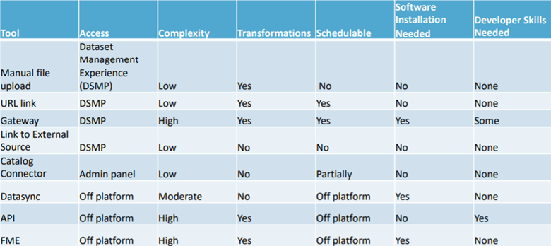

# Automation tool comparison
The following two tables provide additional detail on some of the tools discussed in this section. 

The first compares the capabilities of various automation tools. The other provides some pros and cons for DataSync and Socrata Gateway. 

These tables are from a Socrata support document, which is available in the Socrata support article [Overview of Ingres Methods](https://support.socrata.com/hc/en-us/articles/360052930494-Overview-of-Ingress-Methods){:target="_blank"}.

## Automation Tool Comparison 
| **Method**   | **Pros**                                                                                          | **Cons**                                                                                                    |
|----------|-----------------------------------------------------------------------------------------------|---------------------------------------------------------------------------------------------------------|
| Gateway  | Once scheduling is set up, it will run automatically up to once a day.                      | Users must install software on their own computer or server.                                            |
|          | Supports a wide variety of data sources, including the US Census.                             | The user environment (source system/machine/network factors) can affect the ease of setup.            |
|          | Connections are created and managed through the Dataset Management Experience.              | The user manages the connection.                                                                        |
|          | Transforms, geocoding, and datatypes are easy to set in the Dataset   Management Experience.  | Can only replace data; appending data is not currently possible.                                        |
| DataSync | Provides a basic user interface command tool.                                                 | Free Socrata software, but it resides off the platform.                                                 |
|          | Used to import CSV files from a computer.  Can import files over 4   GB.                      | Requires Java 8 (or newer) and installing DataSync, a small java application, on the user's machine.  |
|          | Can be used to replace all rows, append or upsert rows, or to delete rows.                  | Must be scheduled by an external tool - Windows task manager, for   example.                            |
|          | Used for "port jobs" - an easy way to copy Socrata datasets within or between domains.      | No transforms are applied to data imported via DataSync                                                 |
|          | Can be run headlessly.                                                                        |                                                                                                         |