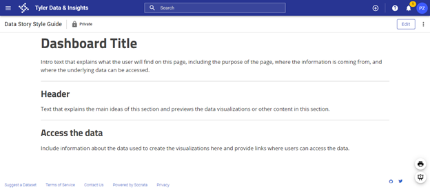
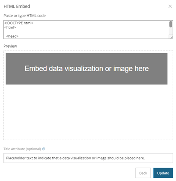

# Data stories 

This section provides information about the use of data stories on the CT Open Data Portal, including the process for developing data stories, best practices, and style recommendations. 

## What are data stories? 

Data Portal stories are simple web pages on the CT Open Data Portal that present data visually using graphics and images. Visualizations tell the story of a published data set to help viewers understand and interpret data trends and context more easily. 

Data stories are helpful for creating digital public-facing reports that make data accessible to a wider audience and can be used to replace PDF reports. Browse data stories on the CT Open Data Portal [here](https://data.ct.gov/stories/s/cnhu-c8np){:target="_blank"}. 

## Process for creating a data story 

Publishers of data on the CT Open Data Portal can work with the Open Data Coordinator to use a simple drag-and-drop tool to develop a data story that highlights and illustrates their data. Here is the process:

### 1. Identify the data you want to highlight.

Determine the data that will be used in the data story. Is this data already published on the Open Data Portal? If not, start to put together the data and metadata that will be published on the Portal and used in the data story. 

### 2.Contact Open Data Coordinator. 

Agency staff interested in developing a data story may email the Open Data Coordinator at [pauline.zaldonis@ct.gov](mailto:pauline.zaldonis@ct.gov). Data owners who have not previously published on the Open Data Portal will first meet with the Open Data Coordinator to establish access. Next, they will discuss the data story process and goals.

### 3.Publish data on the Open Data Portal. 

If the data to be highlighted in the story is not already published on the Open Data Portal, the data should be published as one or more datasets on the Portal. When publishing data on the Portal:

* Ensure that the metadata is complete and makes it easy for users to find and understand the data. 
* Format the data in a way that will allow you to update it easily in the future and will work for data analysis and visualization. Typically data in a long format is easiest to update. 
* Have a plan for keeping the data updated.  

Review the [Data Publication](data-publication-steps) section of this handbook for more detailed information about how to publish data to the Open Data Portal. 

### 4.Draft data story using template.

The Open Data Coordinator will create a new data story using the [data story template](https://data.ct.gov/stories/s/Data-Story-Style-Guide/cc4k-34nm/){:target="_blank"} which promotes consistent styling of Portal data stories. The new data story will be shared with the data story developers. These agency staff will begin to add content to the data story template, including data visualizations and text that highlight the key points of the data story. 

The data story template includes placeholder text and images to illustrate the style guidelines of data stories on the Open Data Portal. The exact layout does not need to be maintained, but all data stories should include: 

* An introduction that provides context and explains what users will find in the data story.
* Charts, tables, or maps that highlight data hosted on the Open Data Portal. 
* Text that describes the trends that you want to highlight in your data. 
* Links to the relevant datasets on the Open Data Portal. 

Tyler Tech has a support article on working with data stories that cover the mechanics of working with data stories: [Creating a Story](https://support.socrata.com/hc/en-us/articles/218691088-Creating-a-Story){:target="_blank"}.

Screenshot of the data story template on the Open Data Portal.

### 5. Develop data visualizations for the data story. 

A number of different data visualization tools can be used to create charts, tables, maps, and other data visualizations to embed in a data story. Data visualizations that are responsive and interactive work best. Consider linking your data visualizations to datasets hosted on the Open Data Portal so that the visualizations update when the underlying data is updated. This allows you to create dashboards that update automatically along with the data. 

Refer to the [Data Visualization Guide](https://portal.ct.gov/-/media/CT-Data/Data-Visualization-Guidelines.pdf){:target="_blank"} for more detailed guidance on developing data visualizations. 

### 6. Open Data Coordinator review of data story. 

Once a draft of the data story has been completed, email the data story link and supporting datasets to the Open Data Coordinator. The Coordinator will review the draft data story and datasets and may offer suggestions for clarity and completeness.

### 7. Internal agency review of data story. 

Agencies are responsible for the accuracy of their published data and data stories, so should conduct their own internal review process before publishing the data story publicly. Agency reviewers will need accounts on the Open Data Portal to access the draft products and complete the review process before the story is made public. Reach out to the Open Data Coordinator for support if needed. 

## Style guide

### 1. Colors

1. **Text colors**: The data story template has default colors loaded for headers and paragraph text, which should be maintained. The color of the dashboard title text can vary. 
    * Headers: #252525
    * Paragraph: #444444
2. **Charts and maps**: When developing charts and maps:
    * Consider using brand colors, either your agency’s or the state’s, in your charts and maps.
    * Use colors with sufficient contrast and use a palette that is accessible to people who are colorblind
    * Use a [color contrast checker](https://webaim.org/resources/contrastchecker/){:target="_blank"} to ensure high enough contrast ratios. Tools like [Colorsafe](http://colorsafe.co/){:target="_blank"} can help create an accessible color palette. Simulators like [Coblis](https://www.color-blindness.com/coblis-color-blindness-simulator/){:target="_blank"} can show what your color scheme might look like to somebody who is colorblind.  
    * Don’t try to communicate a point exclusively through the use of color. Instead, include text (such as direct labels) that explains what each element represents.  
    * Avoid using gender or racial color stereotypes (for example, using baby pink and baby blue to represent women and men).

### 2. Images 

1. **Alternative text descriptions**: Use alternative text for embedded images or data visualizations. Alternative text should convey how the image relates to the content of the data story. It is read aloud by screen readers, is indexed by search engines, and displays on the page if the image fails to load.  
    * When embedding content into data stories, enter the alternative text in the text box labeled “Title Attribute (optional).”

Screenshot of how to add alternative text in a data story.

### 3. Text

1. **Font**. There are four fonts available in data stories (Classic, Sans, Serif, and Slab). The Sans font is used in the data story template. For consistency, use Sans in your data stories. 
2. **Text hierarchy**. For data stories where headers and sub-headers are used, the following text hierarchy is recommended: 
    * Dashboard title: Heading 2
    * Header: Heading 4
    * Sub-header: Heading 6
    * Text: Paragraph  
3. **Links**: Use descriptive links that help people using screen readers understand the purpose of the link. For example, instead of creating a link that says “Learn more”, you should provide more detail about what users can expect. You could say “Learn more about our analysis”. Read more about descriptive links from the Nielson Norman Group: [“Learn More” Links: You Can Do Better](https://www.nngroup.com/articles/learn-more-links/){:target="_blank"}.

### 4. Language

1. **Plain language**. Using plain language can help users find your data story and more easily understand what they are looking at. For more information on plain language visit [plainlanguage.gov](https://www.plainlanguage.gov/?dg){:target="_blank"}. Some guidelines for plain language include: 
    * Use language that is familiar to your audience.
    * Be concise. 
    * Avoid jargon. 
    * Shorten your sentences and paragraphs. 
2. **People-centered language**. When referring to a person or group of people, start with the person, not the characteristic. For instance, “person who is incarcerated” rather than “inmate.”  
    * When creating data visualizations and writing about groups of people, do some research about the preferred terms of those who you are writing about. 
    * Consider how to portray missing data and consider alternatives to a generic “other” category. That can contribute to perceptions of exclusion or omission, “us” versus “them” thinking, and othering underrepresented groups. 

### 5. Spacer and dividers

1. Spacers and dividers offer a visual break between different ideas or elements on a page. 
    * Use spacers between data visualizations to create space between them.
    * Use dividers between different sections of your data story.
    * Consistent use of these elements will promote consistency across the design of data stories on the Open Data Portal. Overuse will make data stories feel inconsistent.

### 6. Content organization 

1. Organize the content of your data story in a way that will be logical to your audience, with the most important information at the beginning.
2. Use headers and sub-headers to organize the content and to break it into smaller sections. 
3. Include intro text at the top of the page that explains what users will find on that page. 
4. Include information about the data used in the story and include access to the underlying data. 
5. Include the date when the page was last updated. 
6. The data story template includes sample “content blocks” that illustrate how embedded content can be integrated into the page. Those are included as examples—that exact layout does not need to be maintained. 

### 7. Linking multiple pages 

1. It can be useful to organize content across multiple data story pages and link them together. This approach is especially useful when your data story includes many different visualizations that can be organized by topic. 

## Resources

1.	[Data Visualization Guidelines](https://portal.ct.gov/-/media/CT-Data/Data-Visualization-Guidelines.pdf){:target="_blank"}, CT Office of Policy and Management
2.	[Accessibility Compliance](https://portal.ct.gov/en/Training/Knowledge-Base/Accessibility-Compliance){:target="_blank"}, Sitecore
3.	[Sitecore Style Guide](https://portal.ct.gov/Training/Knowledge-Base/Style-Guide){:target="_blank"}, Sitecore
