# Detailed data publication steps 

The steps below walk through the steps of creating a new dataset on the CT Open Data Portal. 

## Create a new dataset

1.	Sign into the Open Data Portal at data.ct.gov. If you don’t have an account on the portal, contact the Open Data Portal Administrators at OPM via [dapa@ct.gov](mailto:dapa@ct.gov) to get an account with publishing permissions.

2.	Click the plus sign at the top right of the screen. 

    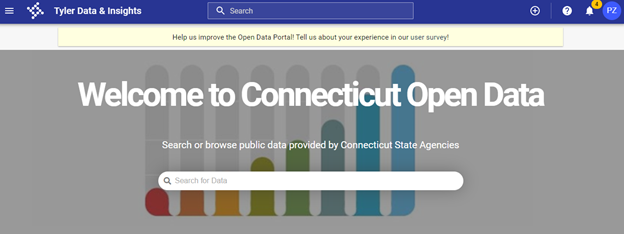

3.	Select “Dataset” when prompted to create a new dataset. Give the dataset a name and click “Create Dataset” to continue. You will be able to edit the dataset name later if needed.

4.	 You will then be taken to the dataset landing page, where you can add data and metadata, pictured below.

     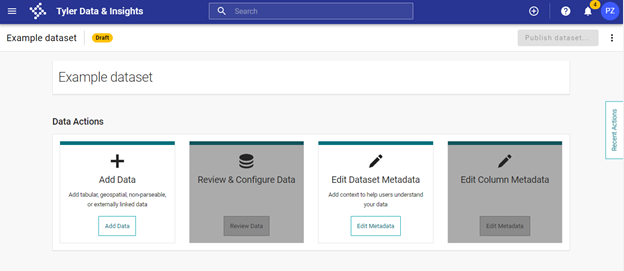

5.	Click on “Add Data” to upload the data. Before importing the file, review the Data preparation and formatting section.

6.	Import the file. There are various options for importing the file, but the most straightforward are dragging your file to the screen or browsing to your file’s location. 
 
     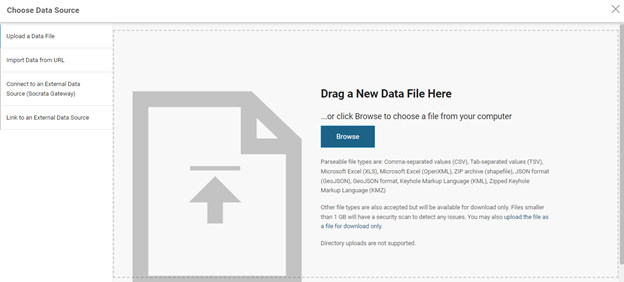

7.	After importing your data, you will be taken to the Preview screen. The open data platform infers the data type for each column; to change the data type use the drop-down menu below the column name. To modify the formatting of the column (e.g. to remove thousands separators from a year, as pictured below), click the three dots next to the column name and select “Column Formatting.”

     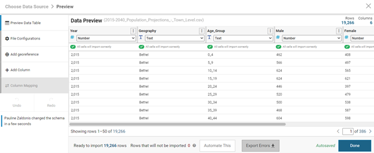

8.	If any errors are detected in your data, the cells with errors will be highlighted in red. To address errors, you may need to make edits to your original data and import it again, or you may be able to make changes in the platform itself. Resolve any errors and make any desired formatting changes. Then click “Done” in the bottom right of the screen. 

     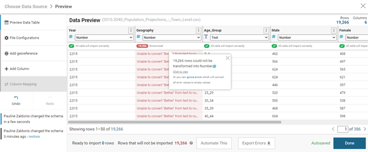

9.	From the landing page, click on “Edit Dataset Metadata.” That will take you to the Dataset Metadata page. 

     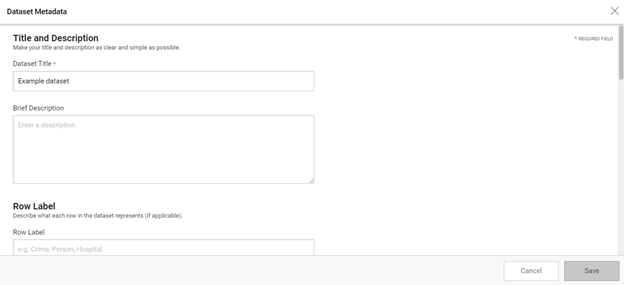

    Fill out every field of metadata that you possibly can. Not only does this help users understand your dataset, but it helps the portal stay organized and improves search functionality, making it more likely that your dataset is seen. Refer to the Metadata Standard for further guidance. 

10.	After you are finished with the Dataset Metadata, click “Save” and navigate back to the landing page. Then click “Edit Column Metadata” to navigate to the Column Metadata page.

    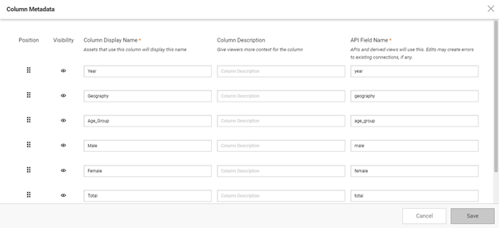

    Enter a descriptive name and a clear description for each column in your dataset. Make sure to use plain language and include any details that will help users understand your data. 

11.	After filling out the Dataset and Column Metadata, you can publish the data. Click “Publish dataset.” Note that you cannot click this button until you have uploaded data and filled out the required metadata.

    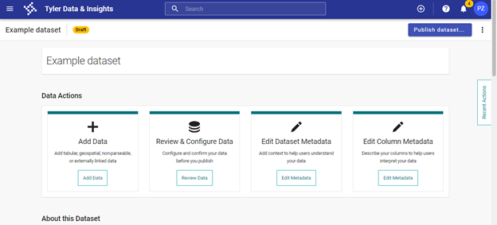

    That will take you to a screen where you can review the changes you’ve made. Pressing “Continue” will take you to a screen where you can select the visibility of your dataset. 

    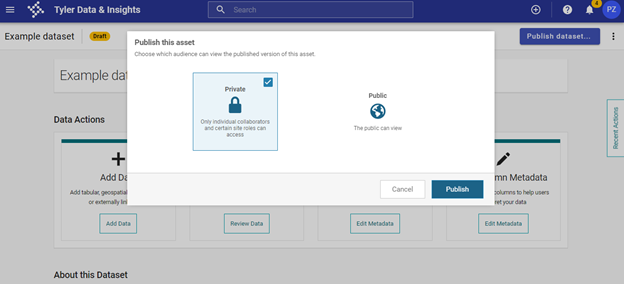

    Select “Private” to publish your dataset privately. 

12.	To share your private dataset with reviewers, click the three dots at the top right corner of the published dataset’s landing page and select “Manage Collaborators.” Then enter the names of the people who need to review the dataset before making it public. These individuals will need accounts on the Open Data Portal; contact the Open Data Coordinator to create additional accounts if necessary by emailing [pauline.zaldonis@ct.gov](mailto:pauline.zaldonis@ct.gov). 

    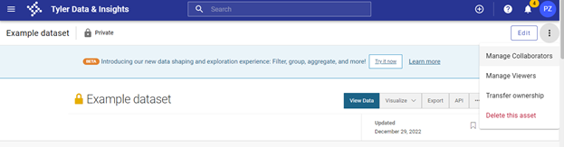

    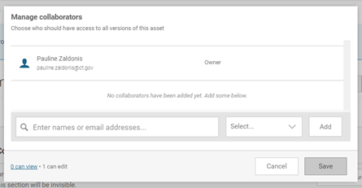

13.	Once your dataset has been reviewed and approved to be made public, you can modify the visibility by clicking “Manage Viewers” in the dropdown menu at the top right of the screen. Then select “Public” and click “Save”. This will make your dataset publicly available on the Open Data Portal. 

    

    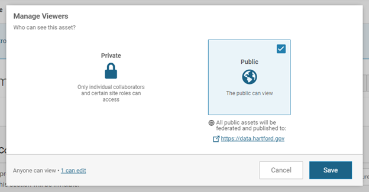

