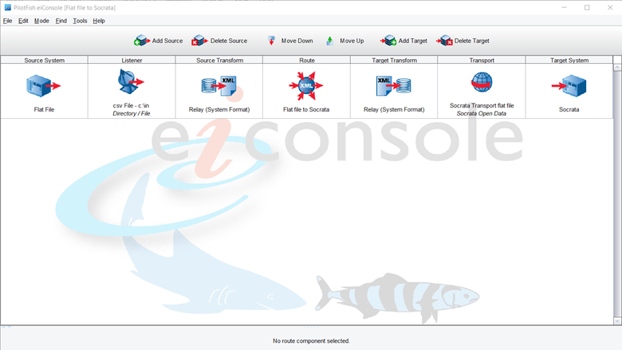
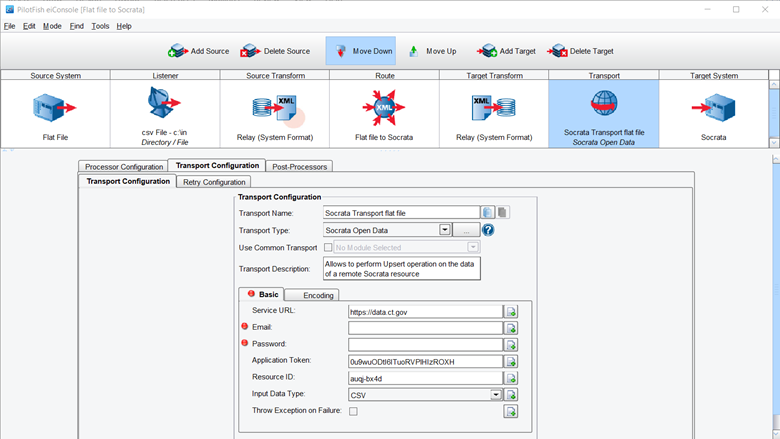

# Pilotfish
Set-up Difficulty: 2 | Use Difficulty: 5 

## What it is
PilotFish is an extremely powerful application tool that combines the PilotFish IDE with the XCS eiConsole. When put together, PilotFish capabilities can be operated through the XCS eiPlatform desktop application. Scheduled updates can be run with ease since PilotFish has a built-in scheduler with a wide range of timing options. 

## How it works
PilotFish works as a pipeline from the source location of the user’s file to a Socrata server, which then connects to the Open Data Portal. The user first creates a new route, where they can choose what kind of source file they wish to reference. The most used source locations are Excel files, CSV files, or a database. This route then takes the source file, performs source transformations, performs target transformations, and then delivers the transformed file to the target location, which would be the Open Data Portal in this situation. For complex transformations, the use can create transformation rules for proper data integration to the Open Data Portal. 

## Prerequisites
* Socrata account with the publisher or owner role 
* An app token for the desired dataset. (This can be found on the Socrata API.) 

## When is this tool a good choice?
If a data set needs advanced transformations to go from a source file to the Open Data Portal, then PilotFish would be a great tool for that job. However, since many of the update jobs on the Open Data Portal simply require an append or replace function, less complex tools may be a better fit. Moreover, PilotFish jobs can only be accessed through the computer in which they were created on. If there was an issue with the user’s computer, then the PilotFish route would have to be recreated on another user’s computer. For this reason, DAS recommends installing PilotFish on an application server, which is almost always up, and are monitored, baked up, and can be given direct access to backend databases. 

If any agency did wish to use PilotFish, they could get access easily since the State of Connecticut has a license for PilotFish services. For more information about the use of PilotFish by Connecticut state agencies, view the enterprise service agreement, available [here](https://portal.ct.gov/-/media/DAS/BEST/Data-Services/DASBESTeServicesEnterpriseDataIntegrationV1.pdf){:target="_blank"}.

For more information on how to set-up and use PilotFish, please contact Matt Shea from the Department of Administrative Services, at [matt.shea@ct.gov](mailto:matt.shea@ct.gov).  

To download PilotFish, visit the following link and click the red “Free Trial” button and log in with your ct.gov email address: https://www.pilotfishtechnology.com/. Those who sign up for the free trial with a valid ct.gov email address should automatically receive a license key.

## Process Overview  
Once you have PilotFish downloaded, visit the following link for an extensive collection of documentation provided by PilotFish [here](https://cms.pilotfishtechnology.com/?_ga=2.258813642.1784563989.1627481862-1295223994.1623077406){:target="_blank"}. 

Basic PilotFish route from flat file (CSV) to data set on the Open Data Portal

Required information to create connection to data set on the Open Data Portal