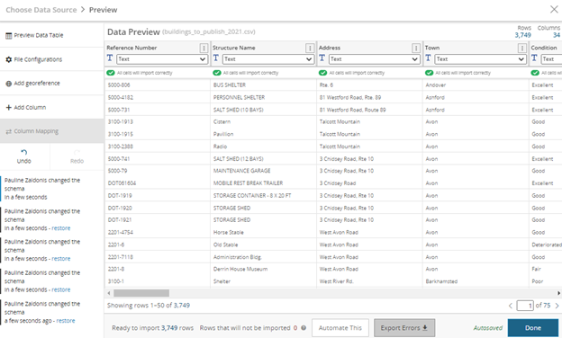

# Socrata-py (Python)
Set-up Difficulty: 4 | Use Difficulty: 2 

## What it is
The Socrata-py package provides Socrata methods and automation capabilities using the Python language. Like Gateway, there is some integration of Socrata-py into the SDMX. 

## How it works
Socrata-py is a Socrata generated Python file that the user can run on a scheduled basis using a task scheduler such as Windows Task Scheduler. Before accessing the Python file, the user must set up environment variables on their local machine for their Socrata username and password. Once this preliminary step is taken, the user can simply create their new dataset on the Open Data Portal and click the “Automate This” button in the Data Preview window. 

Socrata provides update and replace capabilities, which will generate a unique Python script for your dataset and the chosen update function (update or replace). The user can then copy this code from the Open Data Portal, paste it into a text editor (such as Notepad), and save the file using the Python (py) extension. 

## Prerequisites
* Socrata account with the publisher or owner role
* Computer running Python3 or higher 
* The latest version of Python can be downloaded [here](https://www.python.org/downloads){:target="_blank"}.
* Environment variables for Socrata username and password on your local machine

## When is this tool a good choice?
The Socrata-py package is an excellent choice for many datasets on the Open Data Portal. Since there is direct integration into the SDMX, there is minimal set-up needed outside of the Open Data Portal. This guideline document provides a step-by-step of how to get those environment variables set, however, this process still requires knowledge of navigating some advanced settings within your local machine. Furthermore, this tool relies on a task scheduler to be run automatically, thus automatic updates won’t be run unless your computer is on. Although this tool is essentially a Python script, the user does not need any knowledge of the Python programming language. Once the Python script is generated from the Open Data Portal, there is no coding needed going forward. For more information, please visit [this page](https://support.socrata.com/hc/en-us/articles/360016915554-Automate-This-Using-Python-to-Automate-Data-Updates){:target="_blank"} on the Socrata website.

## Process Overview
How to set up required environment variables on your local machine FOR WINDOWS: 
1.	Click the Windows icon in the bottom left of the screen and go to your Settings. 
2.	Select the System option and then select the About option at the bottom of the menu at the left of the screen.  
3.	Scroll down to the bottom of the screen and select the Advanced system settings option. 
4.	A new window will open, and on the Advanced tab, click the Environment Variables button. 
5.	Click the New button under the “User variables for …” list. 
6.	Set the variable name to MY_SOCRATA_USERNAME and the value as your ct.gov email used to log into the Open Data Portal and click OK. 
7.	Click the New button again and this time, set the variable name to MY_SOCRATA_PASSWORD and the value as your Open Data Portal password, then click OK. 
8.	Click OK again on the Environment Variables window, and one more time on the System Properties window. 
9.	To check that your environment variables are set up correctly, open the Command Prompt. 
10.	Enter echo %MY_SOCRATA_USERNAME% and your ct.gov email should be returned. 
11.	Enter echo %MY_SOCRATA_PASSWORD% and your Open Data Portal password should be returned. 
12.	Your environment variables are all set up! 
 
## How to automate a data set using Python scripts: 
1.	Once logged onto the Open Data Portal, click the Create tab on the menu bar at the top of the screen. 
2.	Select the Dataset option. 
3.	Enter the name of your dataset. 
4.	Select the Add Data option on the homepage of your new dataset. 
5.	Select the first option on the menu at the left of the screen – Upload a data file. 
6.	Locate your data file and load the data into the data preview. 
7.	At the bottom of the preview page, click the Automate This button. 
8.	Choose if you would like to run an update or replace transformation on the data set.  
Update will append any rows in the data file to the data set on the Open Data Portal.  
Replace on the other hand will replace the data set on the Open Data Portal with the data file on your local machine. 
9.	Follow the instructions on the screen, which include some lines of Python code that can be copy and pasted. 
10.	Install the socrata-py Python library by going into your local Python environment, such as the command prompt, and running this line of code: pip install socrata-py~=1.0.0. You may want to check to see if you have Pip installed by running: pip --version
11.	Create a .py file containing the chunk of code on the screen starting with the line, “from socrata.authorization import Authorization”. Name it something you will recognize (ex. my-update-script.py), and save the file to the same location as the data file you uploaded to the Open Data Portal. 
12.	Go back to the Open Data Portal, fill out any required metadata, and upload the data set. 
13.	Once the data is uploaded to the Open Data Portal, go to your local Python environment, and run your Python script containing the code from Step 11 to make sure that all environment variables are set up correctly. 
14.	Open a task scheduler, such as Cron or Windows Task Scheduler. 
15.	Create a new basic task, name it, and set the frequency and run time for your task. 
16.	For the action of the task, put this: python3 [your Python script name here]. 
17.	Save the task and now your data set is all set up to be updated automatically using Python! 
